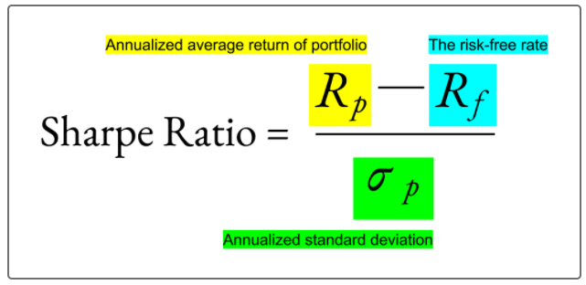
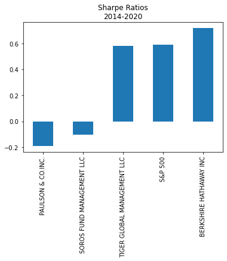
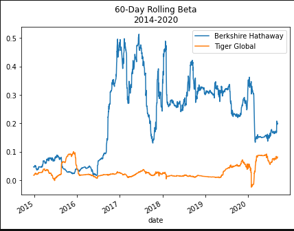

# Challenge_4: Quantitative Investment Portfolio Analysis

UNCC Online FinTech Bootcamp Module 4 Challenge due by 11:59pm 12/26/2021

https://courses.bootcampspot.com/courses/980/pages/4-dot-2-4-evaluating-risk-and-return-the-sharpe-ratio?module_item_id=377238  

---

## Background

In this Challenge, we'll assume the role of a quantitative analyst for a FinTech investing platform. This platform aims to offer clients a one-stop online investment solution for their retirement portfolios that’s both inexpensive and high quality. To keep the costs low, the firm uses algorithms to build each client's portfolio. The algorithms choose from various investment styles and options.

We've been tasked with evaluating four new investment options for inclusion in the client portfolios. Legendary fund and hedge-fund managers run all four selections. We’ll need to determine the fund with the most investment potential based on key risk-management metrics: the daily returns, standard deviations, Sharpe ratios, and betas.

---

### What's being created

We’ll produce a Jupyter notebook that contains data preparation, analysis, and visualizations for key risk and return metrics. We will use text and comments to document our findings. The notebook file will contain the following:

 - A single DataFrame imported from a CSV file that has a `DateTimeIndex`.

 - A risk analysis of the assets that the DataFrame contains vs. the S&P 500. This analysis includes risk-return metrics, including the **daily returns, standard deviation, Sharpe ratio, and beta**.

 - An evaluation of each asset that uses rolling statistics to track the risk-reward behavior over time.

 ---

## Technologies

This application is written in Python 3.7 using JupyterLab version 3.0.14.

Python libraries used:
- Pathlib: [https://docs.python.org/3.7/library/pathlib.html](https://docs.python.org/3.7/library/pathlib.html)  
  Pathlib is a library that enables consistent input and output of files from the main app. 
 - Pandas: [https://pandas.pydata.org/pandas-docs/stable/](https://pandas.pydata.org/pandas-docs/stable/)  
 Pandas is is an open source, BSD-licensed library providing high-performance, easy-to-use data structures and data analysis tools for the Python programming language.

### Installation Guide

prior to running these libraries, install them from the command line:  
  - pandas: `conda install pandas` or `pip install pandas`  
  - pathlib: `pip install pathlib`
---

## Usage

#### Our Jupyter Notebook will be useful in answering the following questions:
  - Do any of the four fund portfolios outperform the S&P 500 index?
  **Based on the cumulative return data and the visualization, NONE of the four fund portfolios outperforms the S&P 500 Index.**
  
  
  
  
  
 ---
 - Based on the box plot visualization of just the four fund portfolios, which fund was the most volatile (with the greatest spread) and which was the least volatile (with the smallest spread)?
 **Answer:  Based on the box plot visualization of the four funds, Berkshire Hathaway was most volatile, and Tiger Global Mgt was least volatile.** 
 
 
 
 ---
 - Based on the annualized standard deviation, which portfolios pose more risk than the S&P 500?
 **Based on the annualized standard deviation, NONE of the portfolios pose more risk than the S&P 500.**

 - Based on the rolling metrics, does the risk of each portfolio increase at the same time that the risk of the S&P 500 increases?
**Yes, it does appear that the risk of each portfolio increases at the same time that the risk of the S&P increases.**

 - Based on the rolling standard deviations of only the four fund portfolios, which portfolio poses the most risk? Does this change over time?
 **Berkshire Hathaway poses most risk overall, although there are time periods where other funds have a higher rolling standard deviation and are more risky.**
 
 ---
 
 - Which of the four portfolios offers the best risk-return profile? Which offers the worst?
 **Answer: Berkshire Hathaway offers the best risk-return profile; Paulson offers the worst.**
 
 
 ---
 - Which of the two portfolios seem more sensitive to movements in the S&P 500?
 **Compared to movement of the S&P 500, Berkshire Hathaway has an average beta of 0.221, and Tiger Global's is only 0.031. Berkshire Hathaway is more sensitive.**

 - Which of the two portfolios do you recommend for inclusion in your firm’s suite of fund offerings?
 **Based on higher Sharpe ratio, I would recommend including the Berkshire Hathaway Inc fund. However, a more conservative approach could select Tiger Global since it is not as sensitive to movement in the S&P 500 as seen below. Particularly if the portfolio is for clients' retirement funds, perhaps Tiger Global would be the wiser choice.**
 
 
 
---
### Contributors

Geoff Tarleton - jobeycat@protonmail.com

adapted from Starter Code supplied by UNCC FinTech Online Bootcamp by Trilogy Educational Services, a 2U, Inc. brand.

---

### License

MIT
